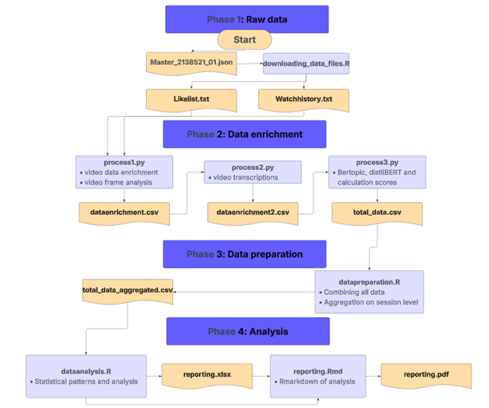

# TikTok Content Diversity On User Engagement
This repository contains code and documentation for analyzing shared TikTok user data. We enriched TikTok video links with metadata such as video descriptions, frame analysis, and transcriptions, and used these features to study consumer behavior and engagement patterns.

## Explanation
This repository contains the full data collection, enrichment, and analysis pipeline used for a thesis on TikTok consumer behavior and content diversity. The project combines both R and Python to process, enrich, and analyze shared TikTok user data at scale.

Using the Python package Pyktok, TikTok activity data and video URLs were collected from users who voluntarily shared their TikTok data exports. Video metadata was subsequently enriched through multiple processing steps, including video descriptions, transcript extraction, and frame-level analysis. MP4 files were downloaded to enable computer vision analysis and automated speech transcription, creating a multimodal dataset that combines textual, visual, and behavioral information.

To measure content diversity, topic modeling and semantic embedding techniques were applied using BERTopic and DistilBERT. Several modeling approaches were compared throughout the research process. Although BERTopic provided interpretable topic clusters, DistilBERT embeddings ultimately proved to be a more robust and sensitive measure for capturing semantic diversity within TikTok consumption patterns, and therefore became the final methodological choice for the thesis analyses.

The repository additionally contains statistical analyses and visualizations examining the relationship between:

Independent Variable (IV): Content Diversity
Dependent Variable (DV): User Engagement
Moderators (MOD):
Engagement Typology
Variety-Seeking Behavior

Included visualizations demonstrate relationships between semantic diversity and engagement outcomes, user-level diversity patterns, moderation effects, and exploratory behavioral trends derived from the enriched TikTok dataset.

This repository is intended to provide a transparent and reproducible workflow for computational social science research on short-form video consumption, recommendation systems, and digital media behavior.

The reporting stage is not taken into account into this repository. We added for analysis an analysis R file and a visualization and descriptive statistics file. The reporting is taken into account to into the thesis.

## Script to run in the following order following to the image

## Disclaimer:
The JSON file used in Step 1 follows the data structure and formatting conventions of Tilburg University. Raw data files from other sources or institutions may differ in structure, naming conventions, or field availability, and might therefore require adjustments before use.

## Work to do by hand
Data is in a format JSON from Tilburg University data format. Change the name in the first R script downloading_data_files to the input file of your input.

Before process3.Py  
1: Add an ID per respondent  
2: Add all personal files together 

Before starting with datapreparation.R. Add 2 datapoints that are not able to scrape or can't be obtained by the data.  
1: Add an var_seek (0 if user has a low level of variety-seeking and a 1 if a user has a high level of variety-seeking, based on a survey)

## Programs and packages
Rstudio / R
Python 3.12.10
### Packages
#### Python packages
This project uses Python version 3.12.10  

*pip install pandas numpy bertopic sentence-transformers umap-learn hdbscan scikit-learn scipy opencv-python ultralytics pyktok tqdm*
#### R packages
If you need to download the R packages, run:  
*install.packages(c(
  "jsonlite", "readr", "dplyr", "tidyverse",
  "readxl", "writexl", "ggplot2",
  "e1071", "purrr", "tibble",
  "plm", "fixest"
))*
## AI-Assisted Development

This repository was developed with support from AI language models, including ChatGPT and Claude, for assistance with programming tasks, workflow optimization, troubleshooting, and documentation. AI-generated suggestions were reviewed, adapted, and validated within the context of the research methodology and thesis objectives.
